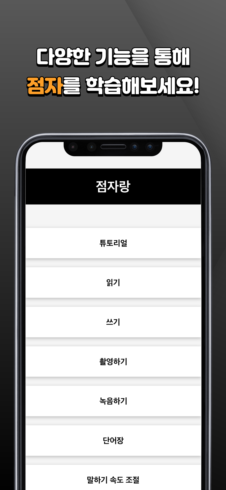
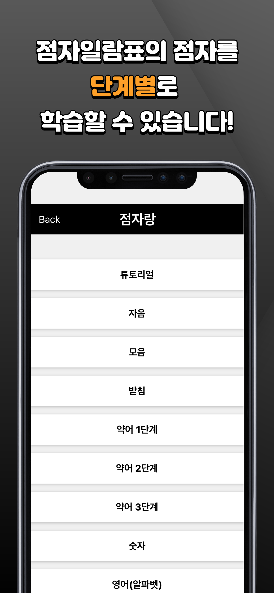
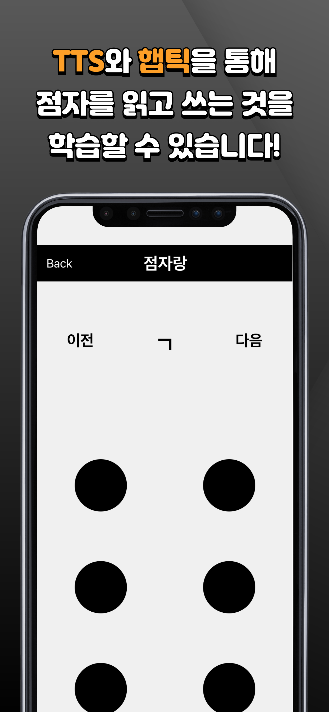
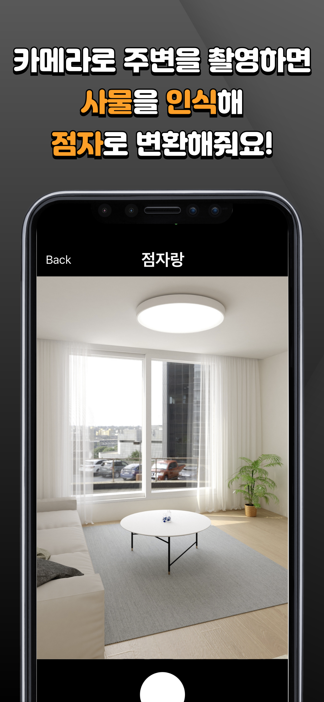
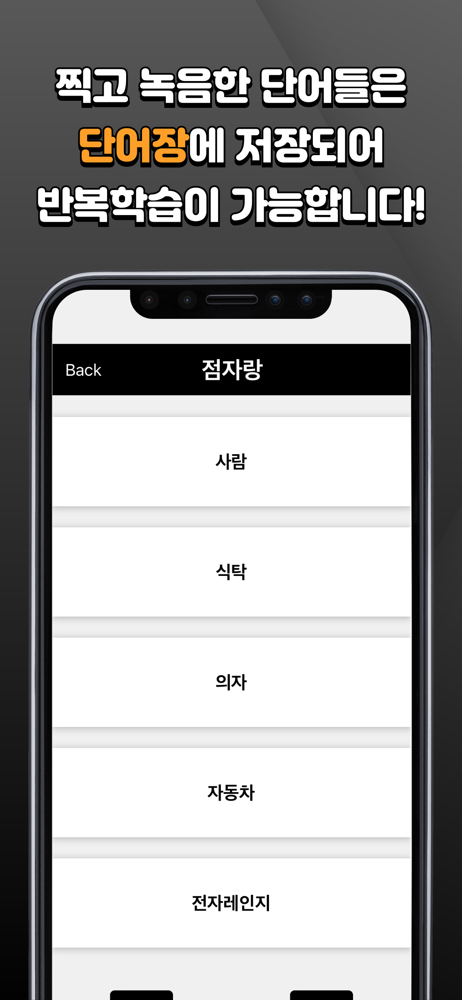

# 시각장애인을 위한 점자 학습 도우미: 점자랑

- 2024학년도 1학기 컴퓨터공학부 졸업설계 어플리케이션 저장소

## 📌 Introduction

### 서비스 개요

<figure>
  
  
  
</figure>

<figure>
  
  
  
</figure>

<figure>
  
  
  
</figure>

- 점자를 읽고 쓰는 것을 단계별로 학습
  - 자음, 모음, 받침, 약자, 숫자, 약어, 문장부호, 영어 알파벳
- 단어장 기능
  - 생활 속 주변 사물을 찍으면 그것을 점자로 변환
  - 개인별 단어장을 만들어 지속적인 점자 활용

## 🧑🏻‍💻 Member

|Name|Role|Git|
|:--:|:--:|:--:|
|Sehyeon Park|팀장|[bboxeeee](https://github.com/BBOXEEEE)
|Seungdae Cho|팀원|[babbaja](https://github.com/babbaja)
|Juyeong Oh|팀원|[JuYeong17](https://github.com/JuYeong17)

## ⚙️ Installation

1. Clone the Repository

```shell
$ git clone https://github.com/BBOXEEEE/braille-education-app.git
$ cd braille-education-app
```

2. Install the project dependencies using npm

```shell
$ npm install
```

3. Run

```shell
$ npx expo start
```

You can run this App. on iOS & Android simulator and your smartphone via Expo Go.
- For Android, directory name must consist of English!
